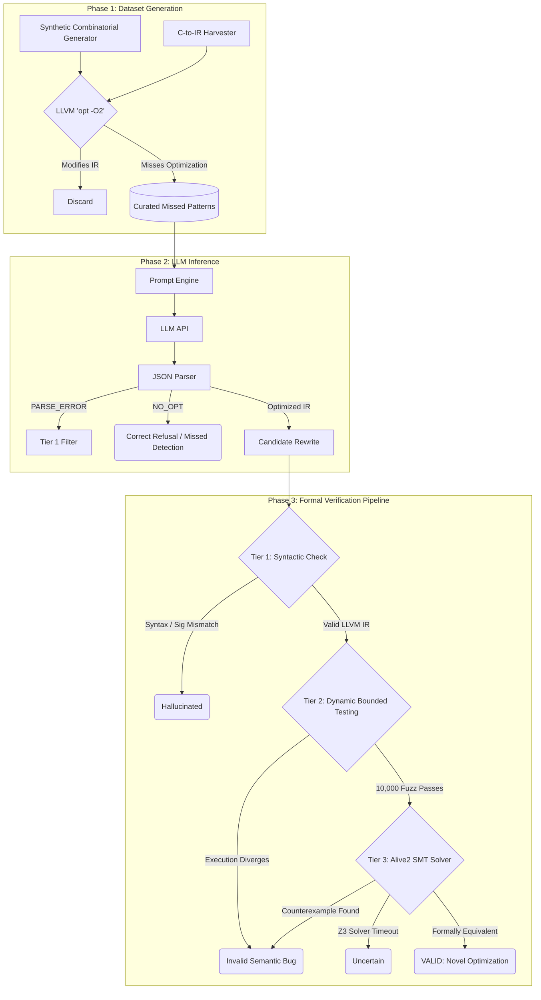

# Design Document - LLM Peephole Optimization

## Research Question

> **Can LLMs discover missed peephole optimizations in LLVM IR?**

Peephole optimizations are small, local rewrites that replace a short instruction sequence with a semantically equivalent but more efficient one. LLVM's optimizer contains thousands of hand-coded patterns, but coverage is incomplete. This project tests whether a large language model can find patterns that LLVM misses.

---

## 1. Approach

### Core Idea

Instead of hand-crafting test cases, we:
1. **Automatically generate** hundreds of LLVM IR patterns
2. **Filter** to only patterns that LLVM's `opt -O2` does not already optimize
3. **Ask an LLM** to suggest simpler rewrites
4. **Validate** every suggestion through 3 independent tiers
5. **Classify** and analyze the results

This creates a controlled experiment: every pattern in the dataset is something LLVM genuinely misses, so any valid LLM rewrite is a real finding.

### Why GPT-OSS, Gemini, and Llama?

| Factor | Capable LLMs (e.g. GPT-OSS-120b) |
|--------|------------------|
| Speed | Fast (~1s/query) |
| LLVM IR knowledge | High |
| JSON output | Reliable |

We evaluated three specific models—**GPT-OSS-120b**, **Gemini 3.1 Flash-Lite**, and **Llama 3.3 70b**—to test a range of architectures (mixture-of-experts vs dense) and deployment strategies (Groq vs Google APIs). State-of-the-art language models possess deep semantic understanding of intermediate representations and can reliably output structured JSON. The approach is inherently model-agnostic, and our framework successfully highlights the disparity in compiler intuition among different architectures.

---

## 2. Dataset Generation Strategy

### Generation and Harvesting

The dataset is constructed by combining synthetic pattern generation with realistic patterns harvested from C code:
- **Combinatorial Generator**: Exhaustively generates simple patterns (e.g., algebraic identities, bitwise operations).
- **C-to-IR Harvester**: Compiles real C functions to LLVM IR using `clang -O1 -emit-llvm`.

### Filtering

We run all generated patterns through `opt -O2`. If the optimizer modifies the IR, the pattern is already handled by LLVM and is discarded. 
The surviving 200 patterns form the final dataset, representing cases that LLVM natively misses.

Patterns LLVM misses tend to be:
- Multi-step algebraic chains
- Conditional patterns
- Overflow-sensitive code
- Bit manipulation idioms
- Strength reduction candidates

---

## 3. Validation Architecture

### Architecture Flow

### Why 3 tiers?

Each tier catches different classes of errors:

| Tier | What it catches | Speed | Completeness |
|------|----------------|-------|-------------|
| **Tier 1: Syntactic** | Parse errors, signature mismatches, unprofitable rewrites | <1ms | Low (syntax only) |
| **Tier 2: Dynamic** | Semantic bugs that manifest on concrete inputs | ~5s | High but probabilistic |
| **Tier 3: Formal** | All semantic bugs including edge cases | ~10s | Complete (sound) |

**Tier 1** is a fast filter: most hallucinated outputs (malformed IR, wrong function signature, no instruction reduction) are caught here.
**Tier 2** finds bugs Tier 1 misses by compiling the IR and testing 10,000 random and boundary inputs.
**Tier 3** provides mathematical certainty: Alive2 uses Z3 to prove equivalence or find a counterexample.

### Classification Taxonomy

- **Valid**: Correct rewrite, formally proven by Tier 3.
- **Uncertain**: Passed Tier 2, but Tier 3 timed out or was unavailable.
- **Invalid**: Failed Tier 2 (semantic bug) or formally disproved by Tier 3.
- **Hallucinated**: Failed Tier 1 (unparseable IR, wrong signature, not profitable).
- **Correct Refusal**: LLM correctly stated no optimization was possible.
- **Missed Detection**: LLM failed to optimize a pattern that we know has an optimization.

---

## 4. Prompt Engineering

### Design choices

1. **System prompt**: Strict rules about semantic equivalence, flag safety, and output format.
2. **Few-shot examples**: Examples covering identity passes, identity with flags, no-opt, and real rewrites.
3. **JSON-only output**: Forces structured responses, easier to parse.
4. **Temperature 0.2**: Low enough for consistency, high enough for exploration.

---

## 5. Alternatives Considered

### Alternative validation approaches

| Approach | Pros | Cons | Decision |
|----------|------|------|----------|
| **Only Alive2** | Formally complete | Slow, may timeout, not always available | Too slow alone |
| **Only dynamic testing** | Fast, practical | Misses edge cases | Not rigorous enough |
| **3-tier cascade** | Fast, thorough, formal | More complex code | Best tradeoff |

---

## 6. Limitations

1. **Simple patterns only**: Single-function, 1-5 instructions. No complex control flow.
2. **No context**: LLM sees one function at a time.
3. **Flag sensitivity**: LLM often drops `nsw`/`nuw` flags.
4. **Alive2 coverage**: The `.opt` format fallback does not handle all IR patterns.

---

## 7. Future Work

- Test additional models (GPT-4, Claude 3.5 Sonnet) for comparison.
- Extend to control-flow patterns (loops, branches).
- Mine real LLVM bug reports for ground-truth missed optimizations.
