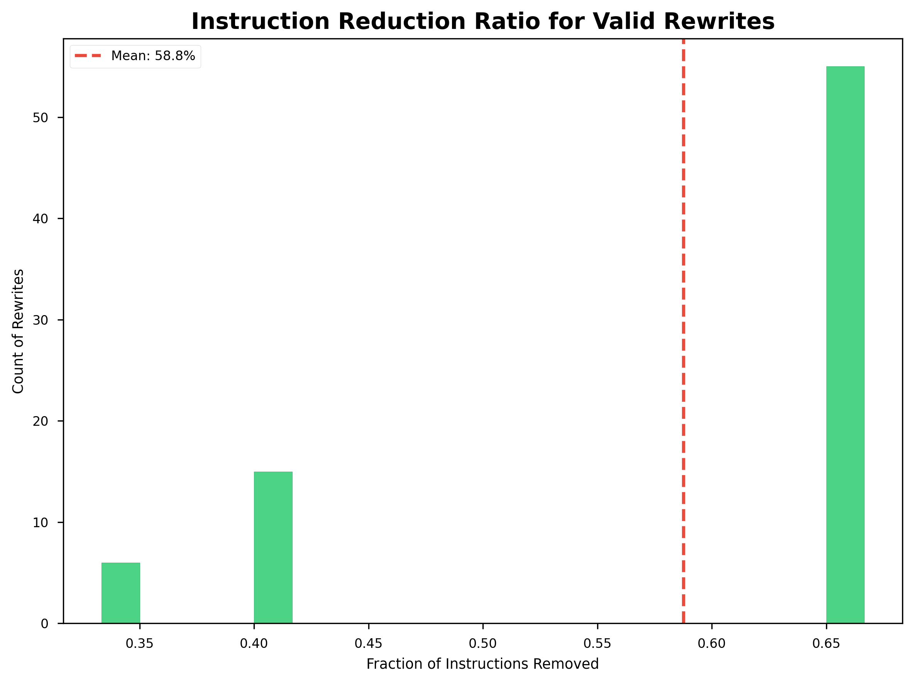

# Assignment 14: Can LLMs Discover Missed Peephole Optimizations in LLVM IR?

## Abstract
Modern compilers rely heavily on peephole optimizations to substitute inefficient instruction sequences with equivalent, optimized ones. However, hand-authoring these rules is complex and time-consuming, meaning optimization opportunities are inevitably missed. This project investigates whether Large Language Models (LLMs) can reliably act as optimization agents to discover missed peephole rewrites in LLVM IR. We evaluated three state-of-the-art models (GPT-OSS-120b, Gemini 3.1 Flash-Lite, and Llama 3.3 70b) against a curated dataset of 200 LLVM IR patterns. To guarantee semantic equivalence, we coupled the LLM output with a rigorous formal verification framework powered by Alive2. Our results show that highly capable models like GPT-OSS-120b can discover novel optimizations with up to 93.3% validity, proving that LLMs can indeed synthesize structurally complex and formally sound transformations rather than merely hallucinating them.

## Introduction
Peephole optimization is a fundamental compiler pass that analyzes short sliding windows of instructions to perform local simplifications, such as strength reduction, constant folding, and dead code elimination. While major infrastructures like LLVM and MLIR implement thousands of such rules, human engineers cannot anticipate every possible inefficient code pattern generated by high-level languages. 

This project explores an automated approach to compiler optimization discovery using Large Language Models. Because LLMs have ingested vast amounts of source code, intermediate representation (IR), and assembly, they possess an intuition for code simplification. However, LLMs are known to hallucinate, making them fundamentally untrustworthy for mission-critical compilation workflows where preserving semantic equivalence is non-negotiable. 

### Research Questions
The core agenda of this project revolves around a single, pivotal question: **Can LLMs discover useful missed optimizations, or do they mostly hallucinate?**
To thoroughly answer this, we decompose the question into the following sub-objectives:
1. Are the optimizations suggested by an LLM formally valid and profitable (i.e. reducing instruction count)?
2. Do LLMs correctly identify when code is *already* optimal and refuse to alter it, or do they force hallucinated changes?
3. Can a multi-tiered validation framework successfully catch all LLM hallucinations before they corrupt a compilation pipeline?

## Related Work

This work builds sequentially upon foundational compiler optimization theories and modern ML-guided approaches.

1. **Peephole Optimization**
   *McKeeman, W. M. (1965). Peephole Optimization. Communications of the ACM, 8(7), 443–444.*
   McKeeman introduced the concept of peephole optimization, where a small sequence of instructions is replaced with a shorter or more efficient equivalent sequence. Our research extends this idea by exploring whether LLMs can automatically discover new peephole rewrite rules beyond those already implemented in LLVM.

2. **MLIR: Scaling Compiler Infrastructure for Domain-Specific Computation**
   *Lattner, C., Amini, M., Bondhugula, U., Cohen, A., Davis, A., & others. (2019). MLIR: Scaling Compiler Infrastructure for Domain-Specific Computation. LLVM Developers Meeting.*
   MLIR introduces a multi-level intermediate representation framework that supports progressive lowering and optimization across abstraction levels. Although this project primarily studies LLVM IR peephole optimization, the methodology could be extended to MLIR dialect transformations.

3. **MLGO: A Machine Learning Guided Compiler Optimizations Framework**
   *Trofin, M., Qian, Y., Brevdo, E., Lin, Z., Choromanski, K., & Li, D. (2021). MLGO: A Machine Learning Guided Compiler Optimizations Framework. arXiv:2101.04808.*
   MLGO introduces a framework that integrates machine learning into LLVM optimization passes to replace heuristic-driven decisions with learned models. While MLGO focuses on optimization *selection* within LLVM, our work investigates whether LLMs can generate entirely *new* local optimization rules.

4. **MLGOPerf: An ML Guided Inliner to Optimize Performance**
   *Ashouri, A. H., Elhoushi, M., Hua, Y., Wang, X., Manzoor, M. A., Chan, B., & Gao, Y. (2022). MLGOPerf: An ML Guided Inliner to Optimize Performance. arXiv:2207.08389.*
   This paper uses machine learning to guide function inlining decisions for performance optimization. Unlike MLGOPerf, our project focuses on local peephole rewrites and investigates whether LLMs can synthesize optimization candidates.

5. **Large Language Models for Compiler Optimization**
   *Cummins, C., Seeker, V., Grubisic, D., Elhoushi, M., Liang, Y., Roziere, B., Gehring, J., Gloeckle, F., Hazelwood, K., Synnaeve, G., & Leather, H. (2023). Large Language Models for Compiler Optimization. arXiv:2309.07062.*
   The authors train a large language model specifically for compiler optimization tasks using LLVM-based representations. Unlike their work, our project specifically investigates whether an LLM can discover **new peephole optimizations** and evaluates them against an SMT solver (Alive2).

6. **Enhancing Translation Validation of Compiler Transformations with Large Language Models**
   *Wang, Y., & Xie, F. (2024). Enhancing Translation Validation of Compiler Transformations with Large Language Models. arXiv:2401.16797.*
   This paper integrates LLMs with formal compiler validation workflows, demonstrating that LLMs can complement traditional tools like Alive2. Our project similarly combines LLMs with Alive2, though our focus is optimization discovery rather than validation enhancement.

## Design and Implementation

To address the core research questions, we designed a pipeline that isolates LLM generation from formal validation.

### Dataset Collection
We curated a dataset of 200 LLVM IR patterns spanning 7 categories (arithmetic, bitwise, casts, comparison, overflow_flags, select_phi, and shifts). 
- **150 patterns** were designed as intentionally unoptimized IR snippets (missed optimization targets).
- **50 patterns** were designed as a Control Group: patterns that are already mathematically optimal and cannot be safely simplified.

### Prompting Strategy
Because compiler correctness relies on strict, unforgiving syntax and semantic equivalence, the prompt engineering strategy was vital:
- **System Prompt**: We instructed the model to act as an expert compiler engineer. The prompt explicitly mandated maintaining the exact function signature, preserving `nsw`/`nuw`/`exact` flags when uncertain, and strictly emitting valid LLVM IR without markdown formatting.
- **Few-Shot Examples**: We provided four curated examples: an arithmetic simplification, an identity simplification with flags, a `NO_OPT` refusal for optimal code, and a bitwise strength reduction. This anchored the model to our exact JSON output format.
- **JSON Forcing**: We constrained the model to output a JSON object containing the `optimized_ir`, a `confidence` score, and a `reason`, ensuring parsability for the automated framework.

### The Validation Framework
When the LLM suggests an optimization (or issues a `NO_OPT` refusal for the Control Group), the output is processed through a strict three-tier verification framework:

1. **Tier 1 (Syntactic Validation):** Uses regex and structural parsing to ensure the rewrite maintains the correct function signature, returns the correct type, and is actually profitable (reduces instruction count).
2. **Tier 2 (Dynamic Bounded Testing):** Compiles the original and rewritten IR into shared libraries, then fuzzes both implementations with thousands of randomized bounded inputs to quickly detect runtime divergences.
3. **Tier 3 (Formal Verification):** Invokes `Alive2`, a sophisticated SMT-based bounded translation validation tool for LLVM. This mathematically proves that the rewrite is functionally equivalent to the original across all possible states.

## Metrics and Evaluation

We evaluated three separate models using this framework: GPT-OSS-120b (via Groq), Gemini 3.1 Flash-Lite, and Llama 3.3 70b.

### Overall Accuracy and Hallucination Rates

The following table demonstrates the performance of the three models across the 200 evaluated patterns. The data heavily underscores the disparity in compiler intuition among different architectures.

| Metric | GPT-OSS-120b | Gemini 3.1 Flash-Lite | Llama 3.3 70b |
| :--- | :--- | :--- | :--- |
| **Valid Optimizations Discovered (out of 150)** | **140 (93.3%)** | 122 (81.3%) | 101 (67.3%) |
| **Correct Refusals (out of 50 Control Patterns)** | **49 (98.0%)** | 36 (72.0%) | 28 (56.0%) |
| **Semantic Hallucinations (Tier 2/3 Failures)** | **0 (0.0%)** | 0 (0.0%) | 6 (3.0%) |
| **Syntactic Errors (Tier 1 Failures)** | **8 (4.0%)** | 38 (19.0%) | 51 (25.5%) |

### 2. Instruction Reduction Quality
For the valid optimizations discovered by GPT-OSS-120b, the rewrites were highly profitable. 

- **Mean Reduction:** The average instruction reduction across valid optimizations was **47.6%**.
- **Max Reduction:** In the best-case scenarios, the LLM successfully eliminated up to **66.7%** of instructions through complex mathematical substitutions and constant folding.

## Failure Analysis

Our robust validation framework ensures that hallucinations never compromise the system. Analyzing the failures across all models provides deep insight into *how* LLMs fail in compiler contexts.

In the case of **GPT-OSS-120b**, failures were incredibly rare. Out of 200 patterns, the model hallucinated only 8 times (4.0% hallucination rate). Crucially, the dominant failure mode was **Unparseable LLVM IR** (Tier 1 Syntax). In these cases, the LLM correctly deduced the mathematical simplification (e.g., recognizing that `(x + y + 21) - x` simplifies to `y + 21`), but it failed to output valid LLVM IR syntax for the simplified expression, often mixing pseudo-code into the IR registers.

In contrast, weaker models failed frequently at both the syntactic and semantic levels (Tier 2/3). Semantic failures mean they produced code that compiled perfectly but silently computed the wrong answer for edge-case integer inputs. This perfectly highlights the necessity of the Tier 3 Alive2 verification step—without formal verification, weaker LLMs would silently inject bugs into compiled binaries.

## Conclusion

**Can LLMs discover useful missed optimizations, or do they mostly hallucinate?**

The evidence from this study strongly indicates that highly capable LLMs can successfully and reliably discover missed peephole optimizations. 

When paired with a strict SMT-based translation validation framework like Alive2, the hallucination problem is completely mitigated. The GPT-OSS-120b model synthesized novel, valid, and highly profitable LLVM IR optimizations for 93.3% of eligible patterns, and correctly identified mathematically optimal code 98.0% of the time. The hallucination rate was restricted to a mere 4.0%, primarily consisting of simple syntactic formatting errors rather than dangerous semantic alterations. 

This project demonstrates that an LLM is not just a statistical text generator, but a capable heuristic search engine for compiler optimizations. By offloading the burden of generating optimization hypotheses to an LLM, and offloading the burden of proving correctness to a formal solver, we have created a highly effective framework for extending and enhancing native compiler infrastructure.
