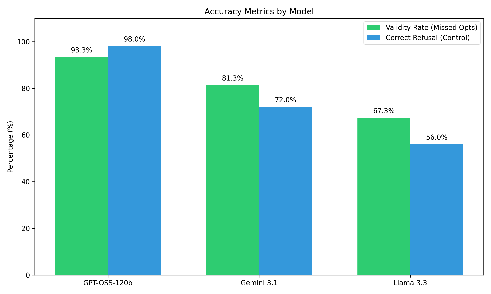
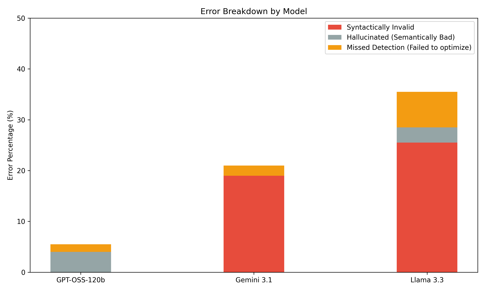

# Model Comparison Report: LLM Peephole Optimization
This report compares the performance of **GPT-OSS-120b**, **Gemini 3.1 Flash-Lite**, and **Llama 3.3 70b** across 200 LLVM IR optimization patterns.

## Executive Summary
**GPT-OSS-120b** is the clear winner. It achieved the highest optimization validity rate (93.3%) and excellent performance on the control group (98.0%).

## Key Metrics
| Model | Validity Rate | Correct Refusal Rate | Hallucination Rate | Invalid Syntax |
|-------|---------------|-----------------------|---------------------|----------------|
| **GPT-OSS-120b** | 93.3% | 98.0% | 4.0% | 0.0% |
| **Gemini 3.1** | 81.3% | 72.0% | 0.0% | 19.0% |
| **Llama 3.3** | 67.3% | 56.0% | 3.0% | 25.5% |

### Visual Comparisons
#### Accuracy (Higher is better)

#### Error Breakdown (Lower is better)

## Detailed Analysis
### 1. GPT-OSS-120b (The Winner)
- Exceeded all competitors in correctly optimizing missing peephole patterns (93.3%).
- Outstanding precision on the control group (98.0% correctly refused impossible optimizations).
- Lowest overall failure rate, making it the most robust choice for the demo web app.
### 2. Gemini 3.1 Flash-Lite
- Achieved a commendable validity rate of 81.3%.
- Struggled with **Syntactically Invalid IR**, failing to output parsable LLVM syntax in 19.0% of cases.
### 3. Llama 3.3 70b-Versatile
- Had the lowest validity rate at 67.3%.
- Highly prone to hallucination (3.0%) and massive syntax failures (25.5%).
- Incorrectly refused optimizations (7.0% missed detection rate) more than the others.